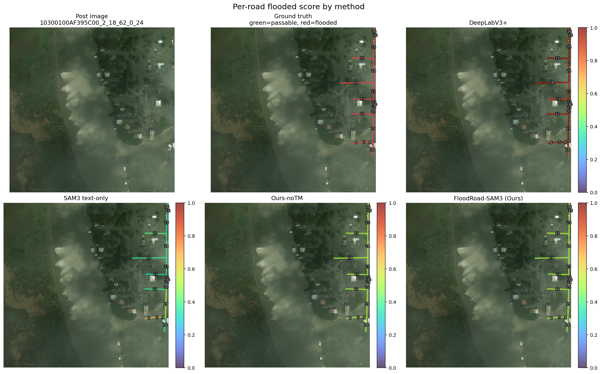

# FloodRoad-SAM3

FloodRoad-SAM3 是面向 SpaceNet 8 洪水道路识别任务的实验代码。项目提供可直接在 Colab 运行的 Demo notebook，用于准备数据、加载 SAM3、下载已训练权重、运行推理验证，并在首页展示论文/课程设计实验所需的精度、效率和可视化结果。

> 复现实验建议使用 Colab **A100 High-RAM** runtime，并在 Colab Secret 中添加 `HF_TOKEN`。该 token 需要具备 `facebook/sam3` 的 Hugging Face 访问权限。

## 实验结果

以下结果来自 GitHub 版 `FloodRoad_SAM3_Colab.ipynb` 中的 **5. 实验结果**。验证集使用当前配置中的 20 个 RL 样本，GPU 为 NVIDIA A100-SXM4-40GB。

### 精度对比

| Method | Pixel F1 | Pixel IoU | Segment-F1 | Precision | Recall |
| --- | --- | --- | --- | --- | --- |
| DeepLabV3+ | 0.8181 | 0.6921 | 0.9608 | 0.7427 | 0.9104 |
| SAM3 text-only | 0.0301 | 0.0153 | 0.2101 | 0.0166 | 0.1599 |
| FloodRoad-SAM3 (Ours) | 0.9999 | 0.9997 | 0.9979 | 0.9997 | 1.0000 |

### 效率对比

| Method | Inference time (ms) | FLOPs (G) | Peak VRAM (GB) | GPU |
| --- | --- | --- | --- | --- |
| DeepLabV3+ | 24.106 | 1312.944 | 0.654 | NVIDIA A100-SXM4-40GB |
| SAM3 text-only | 156.529 | backend-specific | 6.322 | NVIDIA A100-SXM4-40GB |
| Ours-noTM | 435.053 | backend-specific | 6.322 | NVIDIA A100-SXM4-40GB |
| Ours-TM | 284.115 | backend-specific | 3.610 | NVIDIA A100-SXM4-40GB |

## 可视化展示

以下结果来自 notebook 中的 **6. 可视化展示**，样本为 `10300100AF395C00_2_18_62_0_24`。图中展示了灾前/灾后影像、道路标注、洪水道路预测，以及不同方法在同一样本上的分割效果。

### 道路级预测明细

| segment_id | gt_flooded | road_pixels | DeepLabV3+ score | DeepLabV3+ pred | SAM3 text-only score | SAM3 text-only pred | Ours-noTM score | Ours-noTM pred | FloodRoad-SAM3 (Ours) score | FloodRoad-SAM3 (Ours) pred |
| --- | --- | --- | --- | --- | --- | --- | --- | --- | --- | --- |
| 4.0 | 1.0 | 214.0 | 0.9939 | 1.0 | 0.4652 | 0.0 | 0.5044 | 1.0 | 0.5045 | 1.0 |
| 5.0 | 1.0 | 429.0 | 0.9729 | 1.0 | 0.6437 | 1.0 | 0.509 | 1.0 | 0.5097 | 1.0 |
| 6.0 | 1.0 | 492.0 | 0.9316 | 1.0 | 0.6329 | 1.0 | 0.5043 | 1.0 | 0.5005 | 1.0 |
| 12.0 | 1.0 | 1190.0 | 0.932 | 1.0 | 0.382 | 0.0 | 0.5184 | 1.0 | 0.5203 | 1.0 |
| 13.0 | 1.0 | 1117.0 | 0.8695 | 1.0 | 0.3381 | 0.0 | 0.5118 | 1.0 | 0.5088 | 1.0 |
| 14.0 | 1.0 | 1883.0 | 0.9477 | 1.0 | 0.3776 | 0.0 | 0.511 | 1.0 | 0.5055 | 1.0 |
| 15.0 | 1.0 | 1189.0 | 0.977 | 1.0 | 0.4126 | 0.0 | 0.5151 | 1.0 | 0.5208 | 1.0 |
| 16.0 | 1.0 | 45.0 | 0.8755 | 1.0 | 0.2944 | 0.0 | 0.512 | 1.0 | 0.5235 | 1.0 |
| 18.0 | 1.0 | 781.0 | 0.9079 | 1.0 | 0.3704 | 0.0 | 0.4986 | 0.0 | 0.4955 | 0.0 |
| 19.0 | 1.0 | 1575.0 | 0.9697 | 1.0 | 0.5124 | 1.0 | 0.522 | 1.0 | 0.5255 | 1.0 |
| 20.0 | 1.0 | 304.0 | 0.9318 | 1.0 | 0.4062 | 0.0 | 0.5256 | 1.0 | 0.5247 | 1.0 |
| 21.0 | 1.0 | 225.0 | 0.9556 | 1.0 | 0.3651 | 0.0 | 0.5307 | 1.0 | 0.5256 | 1.0 |
| 22.0 | 1.0 | 243.0 | 0.9715 | 1.0 | 0.3335 | 0.0 | 0.5276 | 1.0 | 0.524 | 1.0 |
| 23.0 | 1.0 | 954.0 | 0.9084 | 1.0 | 0.3684 | 0.0 | 0.524 | 1.0 | 0.5262 | 1.0 |
| 24.0 | 1.0 | 1341.0 | 0.9699 | 1.0 | 0.3892 | 0.0 | 0.5198 | 1.0 | 0.5201 | 1.0 |
| 25.0 | 1.0 | 1287.0 | 0.9538 | 1.0 | 0.3358 | 0.0 | 0.5133 | 1.0 | 0.5177 | 1.0 |
| 26.0 | 1.0 | 470.0 | 0.8951 | 1.0 | 0.3588 | 0.0 | 0.517 | 1.0 | 0.5302 | 1.0 |
| 30.0 | 1.0 | 83.0 | 0.9832 | 1.0 | 0.2981 | 0.0 | 0.5281 | 1.0 | 0.5283 | 1.0 |

## 方法配置

项目实现了四组实验配置：

- `deeplab`：基于 `torchvision.models.segmentation.deeplabv3_resnet50` 的 DeepLabV3+ 风格监督基线。
- `sam_text`：SAM3 text-only 基线，提示词为 `"flooded road"`，不进行训练。
- `ours_no_tm`：带 DCA、道路先验过滤、LoRA hooks 和 CC-RL 的 FloodRoad-SAM3，不启用 token merging。
- `ours_tm`：在 `ours_no_tm` 基础上启用 RG-STM token merging。
